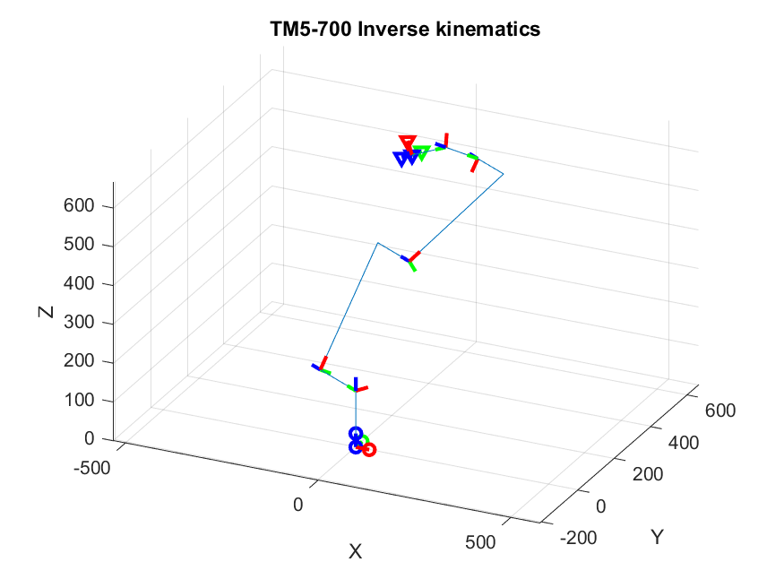
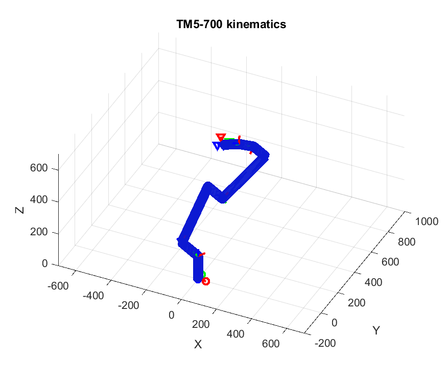
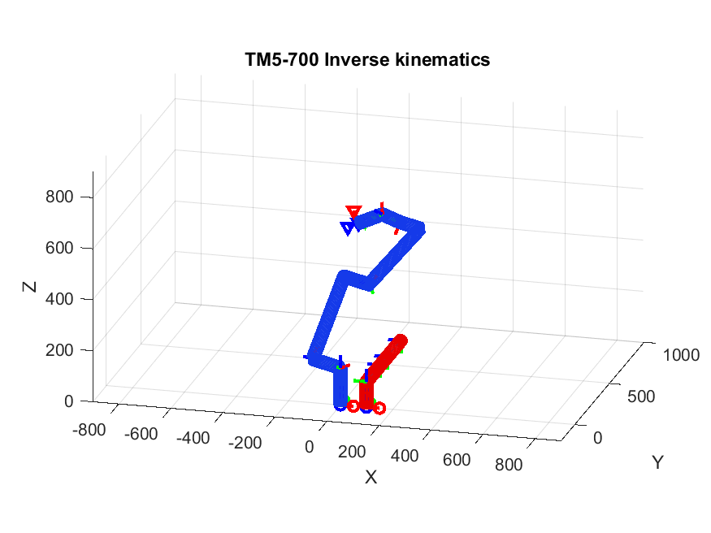
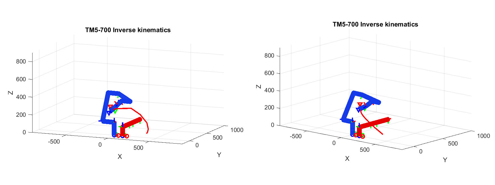
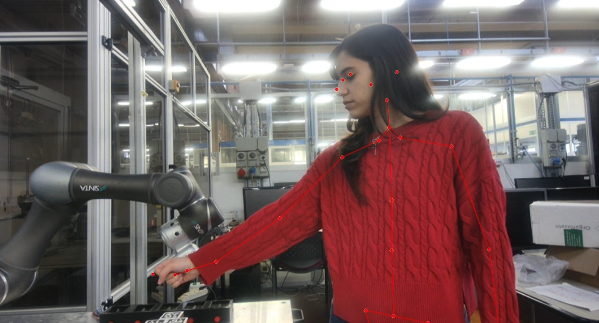
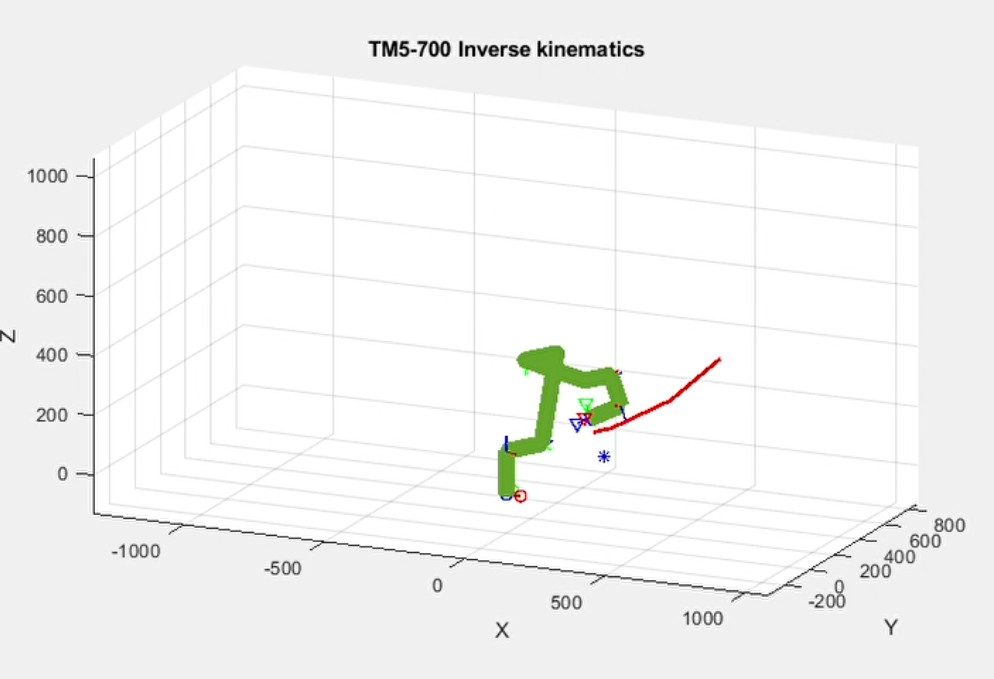

# Collision Avoidance for a Collaborative Robot  

This repository contains the work I conducted as a research assistant at the **University of Padua**, which culminated in my **Master's thesis project**. The goal of this project was to develop a **collision avoidance algorithm** for a collaborative robot (cobot) using **MATLAB**. The **TECHMAN TM5-700** was used as the test platform.  

## Project Overview  

The project involved the following steps:  

1. **Kinematic Study**  
   - Analyzed the kinematics of the TECHMAN TM5-700 cobot.  
   
2. **Collision Avoidance Research & Development**  
   - Studied existing literature on collision avoidance strategies.  
   - Developed a novel approach based on **joint velocities**.  

3. **MATLAB Simulation**  
   - Implemented a MATLAB simulation of the robot's kinematics.  
   - Integrated the collision avoidance strategy into the simulation.  

4. **Human Detection Integration**  
   - Incorporated the **Orbbec Femto Bolt** camera to detect human positioning, specifically tracking the arm.  

5. **Laboratory Testing**  
   - Validated the algorithm experimentally in a controlled lab environment.  

For a detailed explanation, please refer to the document:  
**"Experimental Validation of a Collision Avoidance Strategy for a Collaborative Robot."**  

---

## Code Structure  

During development, I saved intermediate steps as separate scripts, allowing them to be executed independently. However, the following core functions are **dependencies** and cannot be run in isolation:  

- `compute_distance.m`  
- `collision_avoidance.m`  
- `disframe.m`  
- `denavit.m`  
- `drawSSV.m`  

These functions are used within different simulation scripts, described below:  

### **Simulation Scripts**  

- **`simulation_line_robot.m`**  
  *Simulates the inverse kinematics of the robot with simplified line segments representing the links.*  
    

- **`simulation_SSV_robot.m`**  
  *Simulates the inverse kinematics with links modeled as **Superquadrics Swept Volumes (SSVs)** for more accurate representation.*  
    

- **`simulation_with_human.m`**  
  *Simulates the robot with SSVs while integrating the human arm model (both line-based and SSV-based).*  
    

- **`simulation_robot_human.m`**  
  *Simulates the **collision avoidance strategy** with the robot and human arm, both modeled using SSVs.*  
    

- **`simulation_realtime.m`**  
  *Implements real-time collision avoidance by integrating the **Orbbec Femto Bolt** camera. Unlike previous simulations, the human arm is modeled using four key points detected by the camera.*  
    

- **`TRIAL_WITH_TECHMAN_COLLAVOIDANCE.m`**  
  *Used for real-world lab testing of the developed collision avoidance strategy.*  
    

